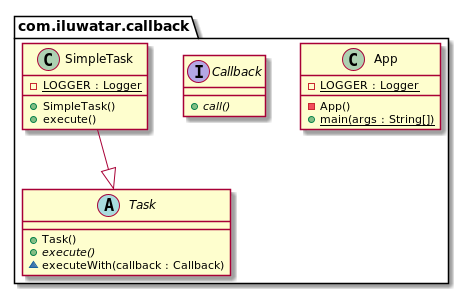

## Intent

Callback is a piece of executable code that is passed as an argument to other code, which is expected to call back (
execute) the argument at some convenient time.

## Also known as

* Event-Subscription
* Listener

## Explanation

Real world example

> We need to be notified after the executing task has finished. We pass a callback method for the executor and wait for
> it to call back on us.

In plain words

> Callback is a method passed to an executor which will be called at a defined moment.

Wikipedia says

> In computer programming, a callback, also known as a "call-after" function, is any executable code that is passed as
> an argument to other code; that other code is expected to call back (execute) the argument at a given time.

**Programmatic Example**

Callback is a simple interface with single method.

```java
public interface Callback {

    void call();
}
```

Next we define a task that will execute the callback after the task execution has finished.

```java
public abstract class Task {

    final void executeWith(Callback callback) {
        execute();
        Optional.ofNullable(callback).ifPresent(Callback::call);
    }

    public abstract void execute();
}

@Slf4j
public final class SimpleTask extends Task {

    @Override
    public void execute() {
        LOGGER.info("Perform some important activity and after call the callback method.");
    }
}
```

Finally, here's how we execute a task and receive a callback when it's finished.

```java
    var task=new SimpleTask();
        task.executeWith(()->LOGGER.info("I'm done now."));
```

## Class diagram



## Applicability

Use the Callback pattern when

* Asynchronous event handling in GUI applications or event-driven systems
* Implementing notification mechanisms where certain events need to trigger actions in other components.
* Decoupling modules or components that need to interact without having a direct dependency on each other

## Known uses

* GUI frameworks often use callbacks for event handling, such as user interactions (clicks, key presses)
* Node.js heavily relies on callbacks for non-blocking I/O operations
* Frameworks that deal with asynchronous operations, like Promises in JavaScript, use callbacks to handle the resolution
  or rejection of asynchronous tasks

## Consequences

Benefits:

* Decouples the execution logic of an operation from the signaling or notification logic, enhancing modularity and
  reusability
* Facilitates asynchronous processing, improving the responsiveness and scalability of applications
* Enables a reactive programming model where components can react to events as they occur

Trade-offs:

* Callback hell or pyramid of doom: Deeply nested callbacks can lead to code that is hard to read and maintain
* Inversion of control can lead to harder-to-follow code flow, making debugging more challenging
* Potential issues with error handling, especially in languages or environments where exceptions are used, as errors
  might need to be propagated through callbacks

## Related patterns

[Observer](https://java-design-patterns.com/patterns/observer/): Callbacks can be seen as a more dynamic and lightweight
form of the Observer pattern, with the ability to subscribe and unsubscribe callback functions dynamically
[Command](https://java-design-patterns.com/patterns/command/): Callbacks can be implemented as Command objects in
scenarios where more flexibility or statefulness is required in the callback operation
[Promise](https://java-design-patterns.com/patterns/promise/): In some languages or frameworks, Promises or Futures can
be used to handle asynchronous operations more cleanly, often using callbacks for success or failure cases

## Real world examples

* [CyclicBarrier](http://docs.oracle.com/javase/7/docs/api/java/util/concurrent/CyclicBarrier.html#CyclicBarrier%28int,%20java.lang.Runnable%29)
  constructor can accept a callback that will be triggered every time a barrier is tripped.
* [JavaScript: The Good Parts](https://amzn.to/3TiQV61)
* [Node.js Design Patterns - Third edition: Design and implement production-grade Node.js applications using proven patterns and techniques](https://amzn.to/3VssjKG)
