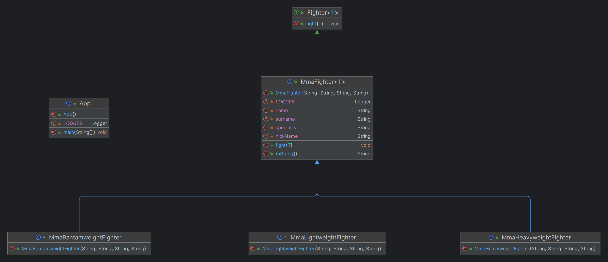

## Also known as

* CRTP
* Mixin Inheritance
* Recursive Type Bound
* Recursive Generic
* Static Polymorphism

## Intent

Curiously Recurring Template Pattern (CRTP) is used to achieve a form of static polymorphism by having a class template derive from a template instantiation of its own class, allowing method overriding and polymorphic behavior at compile time rather than at runtime.

## Explanation

Real-world example

> For a mixed martial arts promotion that is planning an event, ensuring that the fights are organized between athletes of the same weight class is crucial. This prevents mismatches between fighters of significantly different sizes, such as a heavyweight facing off against a bantamweight.

In plain words

> Make certain methods within a type to accept arguments specific to its subtypes.

Wikipedia says

> The curiously recurring template pattern (CRTP) is an idiom, originally in C++, in which a class X derives from a class template instantiation using X itself as a template argument.

**Programmatic example**

Let's define the generic interface Fighter.

```java
public interface Fighter<T> {

    void fight(T t);

}
```

The MMAFighter class is used to instantiate fighters distinguished by their weight class.

```java
public class MmaFighter<T extends MmaFighter<T>> implements Fighter<T> {

    private final String
            name;
    private final String
            surname;
    private final String
            nickName;
    private final String
            speciality;

    public MmaFighter(
            String name,
            String surname,
            String nickName,
            String speciality) {
        this.name =
                name;
        this.surname =
                surname;
        this.nickName =
                nickName;
        this.speciality =
                speciality;
    }

    @Override
    public void fight(
            T opponent) {
        LOGGER.info(
                "{} is going to fight against {}",
                this,
                opponent);
    }

    @Override
    public String toString() {
        return
                name +
                        " \"" +
                        nickName +
                        "\" " +
                        surname;
    }
}
```

The followings are some subtypes of MmaFighter.

```java
class MmaBantamweightFighter extends MmaFighter<MmaBantamweightFighter> {

    public MmaBantamweightFighter(String name, String surname, String nickName, String speciality) {
        super(name, surname, nickName, speciality);
    }

}

public class MmaHeavyweightFighter extends MmaFighter<MmaHeavyweightFighter> {

    public MmaHeavyweightFighter(String name, String surname, String nickName, String speciality) {
        super(name, surname, nickName, speciality);
    }

}
```

A fighter is allowed to fight an opponent of the same weight classes. If the opponent is of a different weight class, an error is raised.

```java
MmaBantamweightFighter fighter1=new MmaBantamweightFighter("Joe","Johnson","The Geek","Muay Thai");
        MmaBantamweightFighter fighter2=new MmaBantamweightFighter("Ed","Edwards","The Problem Solver","Judo");
        fighter1.fight(fighter2); // This is fine

        MmaHeavyweightFighter fighter3=new MmaHeavyweightFighter("Dave","Davidson","The Bug Smasher","Kickboxing");
        MmaHeavyweightFighter fighter4=new MmaHeavyweightFighter("Jack","Jackson","The Pragmatic","Brazilian Jiu-Jitsu");
        fighter3.fight(fighter4); // This is fine too

        fighter1.fight(fighter3); // This will raise a compilation error
```

## Class diagram



## Applicability

* When you need to extend the functionality of a class through inheritance but prefer compile-time polymorphism to runtime polymorphism for efficiency reasons.
* When you want to avoid the overhead of virtual functions but still achieve polymorphic behavior.
* In template metaprogramming to provide implementations of functions or policies that can be selected at compile time.
* You have type conflicts when chaining methods in an object hierarchy.
* You want to use a parameterized class method that can accept subclasses of the class as arguments, allowing it to be applied to objects that inherit from the class.
* You want certain methods to work only with instances of the same type, such as for achieving mutual comparability.

## Tutorials

* [The NuaH Blog](https://nuah.livejournal.com/328187.html)
* Yogesh Umesh Vaity's answer to [What does "Recursive type bound" in Generics mean?](https://stackoverflow.com/questions/7385949/what-does-recursive-type-bound-in-generics-mean)

## Known uses

* Implementing compile-time polymorphic interfaces in template libraries.
* Enhancing code reuse in libraries where performance is critical, like in mathematical computations, embedded systems, and real-time processing applications.
* [java.lang.Enum](https://docs.oracle.com/en/java/javase/17/docs/api/java.base/java/lang/Enum.html)

## Consequences

Benefits:

* Elimination of virtual function call overhead, enhancing performance.
* Safe reuse of the base class code without the risks associated with multiple inheritances.
* Greater flexibility and extensibility in compile-time polymorphism scenarios.

Trade-offs:

* Increased complexity in understanding and debugging due to the interplay of templates and inheritance.
* Can lead to code bloat because each instantiation of a template results in a new class.
* Less flexibility compared to runtime polymorphism as the behavior must be determined entirely at compile time.

## Related Patterns

* [Factory Method](https://java-design-patterns.com/patterns/factory-method/): Can be used in conjunction with CRTP to instantiate derived classes without knowing their specific types.
* [Strategy](https://java-design-patterns.com/patterns/strategy/): CRTP can implement compile-time strategy selection.
* [Template Method](https://java-design-patterns.com/patterns/template-method/): Similar in structure but differs in that CRTP achieves behavior variation through compile-time polymorphism.

## Credits

* [Effective Java](https://www.amazon.com/gp/product/0134685997/ref=as_li_tl?ie=UTF8&camp=1789&creative=9325&creativeASIN=0134685997&linkCode=as2&tag=javadesignpat-20&linkId=4e349f4b3ff8c50123f8147c828e53eb)
* [How do I decrypt "Enum<E extends Enum\<E>>"?](http://www.angelikalanger.com/GenericsFAQ/FAQSections/TypeParameters.html#FAQ106)
