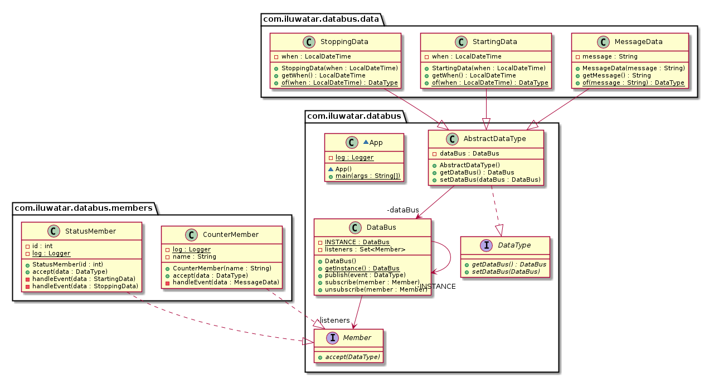

--- # this is so called 'Yaml Front Matter', read up on it here: http://jekyllrb.com/docs/frontmatter/
layout: pattern # layout must allways be pattern
title: Data Bus # the properly formatted title
folder: data-bus # the folder name in which this pattern lies
permalink: /patterns/data-bus/ # the permalink to the pattern, to keep this uniform please stick to /patterns/FOLDER/

# both categories and tags are Yaml Lists
# you can either just pick one or write a list with '-'s
# usable categories and tags are listed here: https://github.com/iluwatar/java-design-patterns/blob/gh-pages/_config.yml
categories: Architectural # categories of the pattern
tags: # tags of the pattern
 - Java
 - Difficulty-Intermediate
---

## Intent

Allows send of messages/events between components of an application
without them needing to know about each other. They only need to know
about the type of the message/event being sent.

## Applicability
Use Data Bus pattern when

* you want your components to decide themselves which messages/events they want to receive
* you want to have many-to-many communication
* you want your components to know nothing about each other

## Related Patterns
Data Bus is similar to

* Mediator pattern with Data Bus Members deciding for themselves if they want to accept any given message
* Observer pattern but supporting many-to-many communication
* Publish/Subscribe pattern with the Data Bus decoupling the publisher and the subscriber
