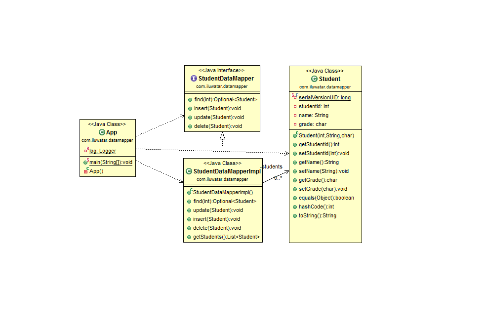

## Intent
>Data Mapper is the software layer that separates the in-memory objects from the database.
>Its responsibility is to transfer data between the objects and database and isolate them from each other. 
>If we obtain a Data Mapper, it is not necessary for the in-memory object to know if the database exists or not.
>The user could directly manipulate the objects via Java command without having knowledge of SQL or database.

## Explanation

Real world example
>When a user accesses a specific web page through a browser, he only needs to do several operations to the browser.
> The browser and the server will take the responsibility of saving data separately.
> You don't need to know the existence of the server or how to operate the server.

In plain words
>A layer of mappers that moves data between objects and a database while keeping them independent of each other.

Wikipedia says
>A Data Mapper is a Data Access Layer that performs bidirectional transfer of data between a persistent data store 
> (often a relational database) and an in-memory data representation (the domain layer). The goal of the pattern is to 
> keep the in-memory representation and the persistent data store independent of each other and the data mapper itself. 
> This is useful when one needs to model and enforce strict business processes on the data in the domain layer that do 
> not map neatly to the persistent data store. 

**Programmatic Example**

>We have the student class to defining Students' attributes includes studentId, name and grade.
>We have an interface of StudentDataMapper to lists out the possible behaviour for all possible student mappers.
>And StudentDataMapperImpl class for the implementation of actions on Students Data.

```java

public final class Student implements Serializable {

    private static final long serialVersionUID = 1L;

    @EqualsAndHashCode.Include
    private int studentId;
    private String name;
    private char grade;


    public interface StudentDataMapper {

        Optional<Student> find(int studentId);

        void insert(Student student) throws DataMapperException;

        void update(Student student) throws DataMapperException;

        void delete(Student student) throws DataMapperException;
    }

    public final class StudentDataMapperImpl implements StudentDataMapper {
        @Override
        public Optional<Student> find(int studentId) {
            return this.getStudents().stream().filter(x -> x.getStudentId() == studentId).findFirst();
        }

        @Override
        public void update(Student studentToBeUpdated) throws DataMapperException {
            String name = studentToBeUpdated.getName();
            Integer index = Optional.of(studentToBeUpdated)
                    .map(Student::getStudentId)
                    .flatMap(this::find)
                    .map(students::indexOf)
                    .orElseThrow(() -> new DataMapperException("Student [" + name + "] is not found"));
            students.set(index, studentToBeUpdated);
        }

        @Override
        public void insert(Student studentToBeInserted) throws DataMapperException {
            Optional<Student> student = find(studentToBeInserted.getStudentId());
            if (student.isPresent()) {
                String name = studentToBeInserted.getName();
                throw new DataMapperException("Student already [" + name + "] exists");
            }

            students.add(studentToBeInserted);
        }

        @Override
        public void delete(Student studentToBeDeleted) throws DataMapperException {
            if (!students.remove(studentToBeDeleted)) {
                String name = studentToBeDeleted.getName();
                throw new DataMapperException("Student [" + name + "] is not found");
            }
        }

        public List<Student> getStudents() {
            return this.students;
        }
    }
}

```

>The below example demonstrates basic CRUD operations: Create, Read, Update, and Delete between the in-memory objects
> and the database.

```java
@Slf4j
public final class App {

  private static final String STUDENT_STRING = "App.main(), student : ";

  public static void main(final String... args) {

    final var mapper = new StudentDataMapperImpl();

    var student = new Student(1, "Adam", 'A');

    mapper.insert(student);

    LOGGER.debug(STUDENT_STRING + student + ", is inserted");

    final var studentToBeFound = mapper.find(student.getStudentId());

    LOGGER.debug(STUDENT_STRING + studentToBeFound + ", is searched");

    student = new Student(student.getStudentId(), "AdamUpdated", 'A');

    mapper.update(student);

    LOGGER.debug(STUDENT_STRING + student + ", is updated");
    LOGGER.debug(STUDENT_STRING + student + ", is going to be deleted");

    mapper.delete(student);
  }

  private App() {
  }
}
```

Program output:

15:05:00.264 [main] DEBUG com.iluwatar.datamapper.App - App.main(), student : Student(studentId=1, name=Adam, grade=A), is inserted
15:05:00.267 [main] DEBUG com.iluwatar.datamapper.App - App.main(), student : Optional[Student(studentId=1, name=Adam, grade=A)], is searched
15:05:00.268 [main] DEBUG com.iluwatar.datamapper.App - App.main(), student : Student(studentId=1, name=AdamUpdated, grade=A), is updated
15:05:00.268 [main] DEBUG com.iluwatar.datamapper.App - App.main(), student : Student(studentId=1, name=AdamUpdated, grade=A), is going to be deleted


This layer consists of one or more mappers (or data access objects) that perform data transfer. The scope of mapper implementations varies.
A generic mapper will handle many different domain entity types, a dedicated mapper will handle one or a few.

## Explanation

Real-world example

> When accessing web resources through a browser, there is generally no need to interact with the server directly;
> the browser and the proxy server will complete the data acquisition operation, and the three will remain independent.

In plain words

> The data mapper will help complete the bi-directional transfer of persistence layer and in-memory data.

Wikipedia says

> A Data Mapper is a Data Access Layer that performs bidirectional transfer of data between a
> persistent data store (often a relational database) and an in-memory data representation (the domain layer).

Programmatic example

## Class diagram


## Applicability
Use the Data Mapper in any of the following situations

* when you want to decouple data objects from DB access layer
* when you want to write multiple data retrieval/persistence implementations

## Tutorials

* [Spring Boot RowMapper](https://zetcode.com/springboot/rowmapper/)
* [Spring BeanPropertyRowMapper tutorial](https://zetcode.com/spring/beanpropertyrowmapper/)
* [Data Transfer Object Pattern in Java - Implementation and Mapping (Tutorial for Model Mapper & MapStruct)](https://stackabuse.com/data-transfer-object-pattern-in-java-implementation-and-mapping/)

## Known uses
* [SqlSession.getMapper()](https://mybatis.org/mybatis-3/java-api.html)

## Consequences

> Neatly mapped persistence layer data
> Data model follows the single function principle

## Related patterns
* [Active Record Pattern](https://en.wikipedia.org/wiki/Active_record_pattern)
* [Object–relational Mapping](https://en.wikipedia.org/wiki/Object%E2%80%93relational_mapping)

## Credits
* [Data Mapper](http://richard.jp.leguen.ca/tutoring/soen343-f2010/tutorials/implementing-data-mapper/)
