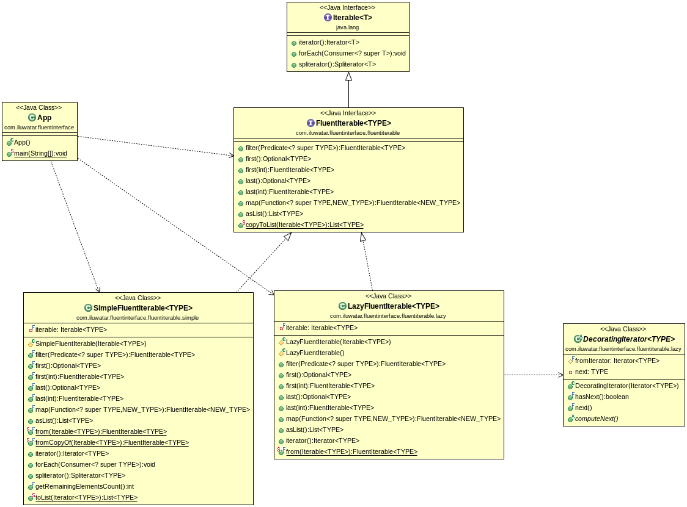

**Intent:** A fluent interface provides an easy-readable, flowing interface, that often mimics a domain specific language. Using this pattern results in code that can be read nearly as human language.

**Implementation:**

A fluent interface can be implemented using any of
 
 * Method Chaining - calling a method returns some object on which further methods can be called.
 * Static Factory Methods and Imports
 * Named parameters - can be simulated in Java using static factory methods.

**Applicability:** Use the Fluent Interface pattern when

* you provide an API that would benefit from a DSL-like usage
* you have objects that are difficult to configure or use

**Real world examples:**

* [Java 8 Stream API](http://www.oracle.com/technetwork/articles/java/ma14-java-se-8-streams-2177646.html)
* [Google Guava FluentInterable](https://github.com/google/guava/wiki/FunctionalExplained)
* [JOOQ](http://www.jooq.org/doc/3.0/manual/getting-started/use-cases/jooq-as-a-standalone-sql-builder/)
* [Mockito](http://mockito.org/)
* [Java Hamcrest](http://code.google.com/p/hamcrest/wiki/Tutorial)

**Credits**

* [Fluent Interface - Martin Fowler](http://www.martinfowler.com/bliki/FluentInterface.html)
* [Evolutionary architecture and emergent design: Fluent interfaces - Neal Ford](http://www.ibm.com/developerworks/library/j-eaed14/)
* [Internal DSL](http://www.infoq.com/articles/internal-dsls-java)
